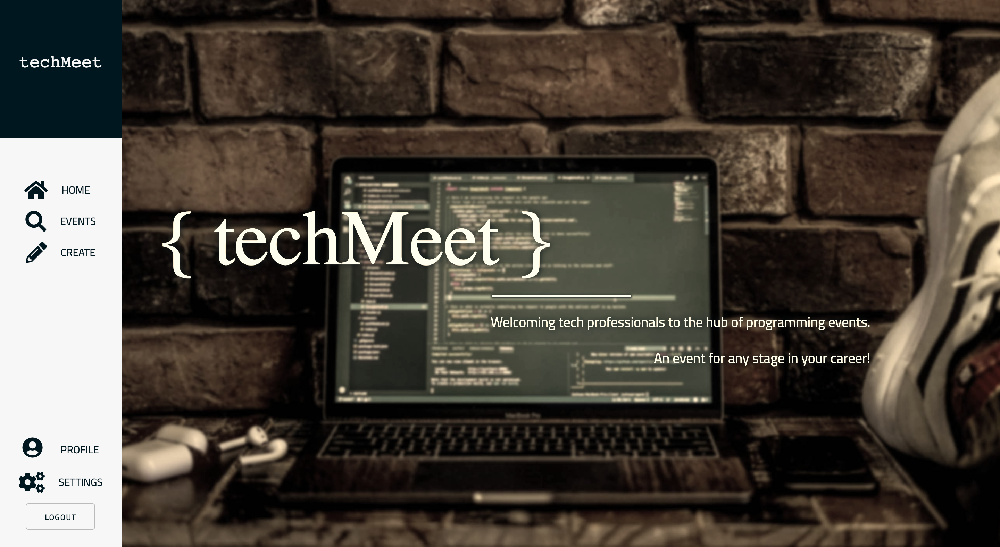
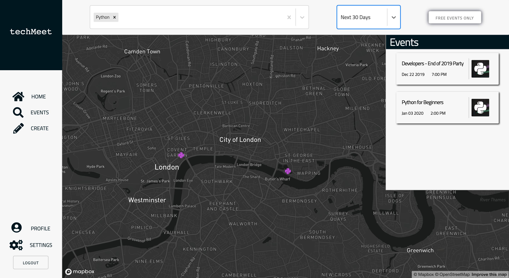
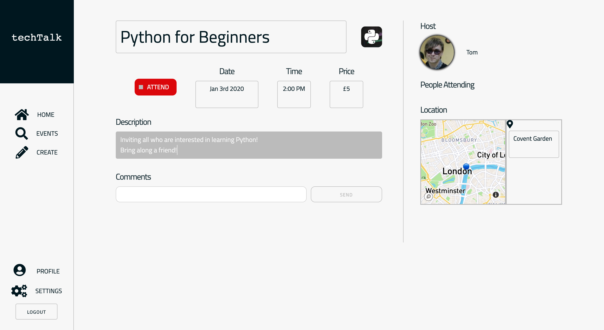
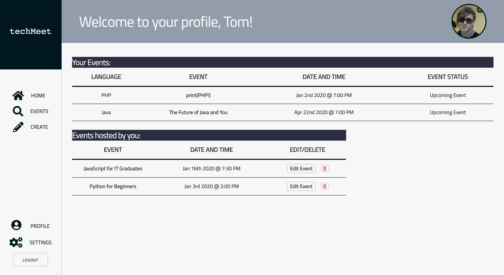

# TechMeet


## Intro
An events-finder specialised for Tech professionals looking to find programming-based events.

TechMeet is a group project created whilst studying at General Assembly in the Software Engineering Immersive.This is a MERN stack application using React for the front-end, Express and Node.js for the back-end and serving my data via a MongoDB database.

Duration: 1 week

#
## Motivation
We wanted to re-create the [Meet-up](https://www.meetup.com/) website but as new developers, we wanted to specialise the app towards other Tech professionals like ourselves.

During the planning stage of our project, the group agreed we wanted to use an external API within our application and use it as a key feature. We chose [Mapbox](https://www.mapbox.com/).


#
## Table of Contents
- [Tech Used](##tech-used)
- [Deployment](##deployment)
- [Getting Started](##getting-started)
- [Architecture](##architecture)
- [Team Work](##team-work)
- [Challenges](##challenges)
- [Improvements](##future-improvements)
- [Developers](##developers)


#
## Tech used
* MongoDB
* JavaScript
    * Express
    * React
    * Axios
    * Moment
* Node.js
* Mocha/Chai
* Skeleton
* HTML5/SAAS


#
## Deployment
This web app is deployed on Heroku and it can be found here: https://tech-meet.herokuapp.com/


## Getting Started
Use the clone button to download the source code. In the terminal enter the following commands:

```
<!-- To install all the packages listed in the package.json: -->
$ yarn

<!-- Run the app in your localhost: -->
$ yarn start

<!-- Check the console for any issues and if there are check the package.json for any dependancies missing  -->
```

#
## Architecture

### Database
We created many events for our database in the seeds.js. We served this database using React to display the events in the front-end.

### Home & Vertical Navigation Sidebar
This is a simple landing page with a background image and some text to highlight the core concept of the website.


The vertical navigation sidebar was selected to style the website in a slightly different way to a common website which usually has a horizontal navigation bar. The navigation links change depending if the the user is signed in or not.

### Register, Login & Profile Settings
The website was created to work well for both registered and non-registered users. If events want to be created or attended, users must use the Register page to sign up and must login on the Login page. 


For registered users, a Profile Settings page is available if they decide to change their login details.


### MapBox & Events Index
This page obtains data from the back-end and is displayed in the Event box(on the left side of the screen). MapBox was used to display the locations of the events, in addition we decided to use the logos of the programming languages as a pin for the map.

All of the events displayed on the map and in the Event box can be sifted by using the filtering options at the top of the website.



### Event Show & Edit
The Event Show page displayed further information about an event such as an event description, the host, attendees if any and comments made my the host or attendees. The user can decide to attend an event by clicking on the red 'Attend' button. In addition, for the host of an event, this page acts as an Edit page simply by clicking on the event name, date, time, price or description boxes(as highlighted below).


### Event Create
The Event Create page is accessible only by registered users to organise new events.


### Profile
A registered user can view their Profile page to keep a track of events they have signed up for, as well as events they are hosting.

Please refer to 'My contributions' below for more information.


#
## My contributions 👩🏻‍💻
### Profile
I was responsible for the front-end of the Profile page.


Originally the group planned to make the appearance of the Profile page look like a dashboard. However, considering the little data there was to display, I communicated the need to change the structure of the Profile page to the team. Due to lack of time, they decided to trust my judgement on creating a Profile page that would fit in perfectly with the developed website at the time. During the Profile page development, I came across a colour scheme of light yellow and dark gray and the team liked it. However, I felt it did not fit in completely so I tweaked the colour from light yellow to a dark navy blue.


#
## Team Work
### Planning
Initally, the group used Trello as a way to plan our project. However, as we got through the basic setup of our application we used daily stand-up meetings to organise work delegation and to discuss the status of each web page of our application.


### Testing
As we began to build our back-end, the whole group contributed in creating automated tests for a RESTful resource on the back-end, events.

#
## Challenges
A challenge I faced during this project was getting the event status to appear correctly depending on whether the date had passed, was yet to come or if the date on today. I overcame this problem by studying the Moment documentation and looking at the best methods to obtain the result I was looking for. Also, Moment was used in the Event Index page, so I worked with a group member to look at the most appropriate method.

To set up the event status in the 'Your Events' table, I used Moment's 'isBefore()' and 'isSame()' methods, and ternary operators to differentiate between the different statuses.

```
<td>{moment(event.date).format('MMM Do YYYY')} @ {moment(event.time,'HH:mm').format('h:mm A')}</td>

<td>{moment().isBefore(event.date) ? 'Upcoming Event' : moment().isSame(event.date) ? 'Event Today' : 'Attended'}</td>
```

#
## Improvements
The improvements that would make this project better is having cleaner code and commenting code for readability. Due to lack of time, as a group we were unable to do this. However, I believe in the future this should be given more importance from the beginning rather than an afterthought.

#
## Developers
- Reema Patel
- Tom Good: https://github.com/TE-Good
- Sophie Turnell: https://github.com/sophieturnell
- Vikram Bageja: https://github.com/vikram1510
